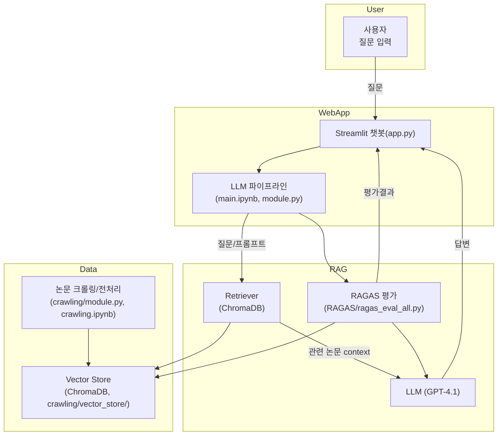

```mermaid
flowchart TD
    subgraph User
        U["사용자\n질문 입력"]
    end
    subgraph WebApp
        ST["Streamlit 챗봇(app.py)"]
        G["LLM 파이프라인(main.ipynb, module.py)"]
    end
    subgraph RAG
        RET["Retriever\n(ChromaDB)"]
        LLM["LLM (GPT-4.1)"]
        RAGAS["RAGAS 평가(RAGAS/ragas_eval_all.py)"]
    end
    subgraph Data
        CR["논문 크롤링/전처리\n(crawling/module.py, crawling.ipynb)"]
        VS["Vector Store\n(ChromaDB, crawling/vector_store/)"]
    end

    U -->|질문| ST
    ST --> G
    G -->|질문/프롬프트| RET
    RET -->|관련 논문 context| LLM
    LLM -->|답변| ST
    CR --> VS
    RET --> VS
    G --> RAGAS
    RAGAS --> VS
    RAGAS --> LLM
    RAGAS -->|평가결과| ST
``` 